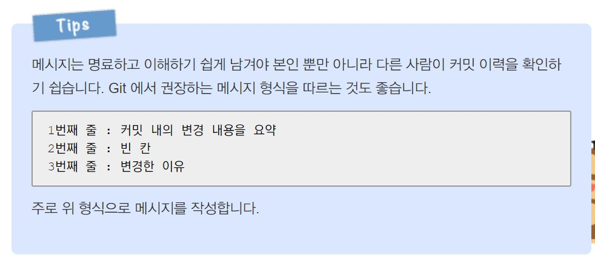

# Test
GitHub desktop test repository입니다. 테스트를 위해서 작성된 repository입니다.  
Notepad++를 사용해 작성된 문서이며 윗줄의 맨 마지막줄에 스페이바를 두번 눌러 띄어쓰기를 하여야 이렇게 다음줄로 넘어오게 됩니다.  
# Header 1 (h1)
## Header 2 (h2)
### Header 3 (h3)
#### Header 4 (h4)
##### Header 5 (h5)
###### Header 6 (h6)

## 목록(Lists)
unordered  
* Item 1
* Item 2
	* Item 2a
	* Item 2b
Ordered
1. Item 1
1. Item 2
1. Item 3
	1. Item 3a
	1. Item 3b

## 이미지(Images)
### 첫번째 방법  

Format: 

### 두번째 방법  
  
Format: img 태그사용 - 이미지경로는 상대경로 혹은 절대경로(대체로 상대경로)  

## 하이퍼링크(Links)  
[WoonSeong Jeong](http://wsjeong.site "WoonSeong Jeong's site")

## Markdown 참고 블러그  
[마크다운 가이드, 문법정리 및 작성규칙](https://post.naver.com/viewer/postView.nhn?volumeNo=24627214&memberNo=42458017 "마크다운 규칙") 
